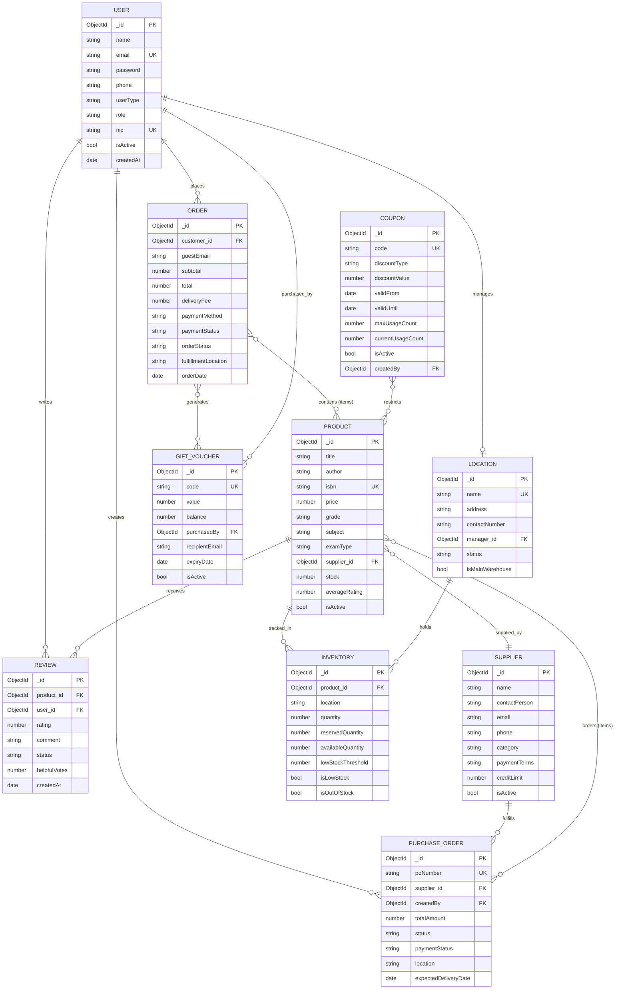

# IE2091 – Information Systems Project | Practical 3
## Database Design: Entity & Attribute Identification
### Project: Methsara Publications Webstore

**System Type:** MERN Stack E-Commerce Web Application  
**Domain:** Educational Book Sales (Grade 6–13, O/L, A/L, Scholarship)  
**Database:** MongoDB (NoSQL Document Database)

---

## Task 1: Entity / Collection Identification

The following **10 entities / collections** were identified from the project codebase:

| # | Entity (Collection) | Description |
|---|---------------------|-------------|
| 1 | **User** (`users`) | Customers and all staff members (admin, managers) |
| 2 | **Product** (`products`) | Educational books listed in the webstore |
| 3 | **Review** (`reviews`) | Customer ratings and comments on products |
| 4 | **Order** (`orders`) | Customer purchase orders (registered & guest) |
| 5 | **Supplier** (`suppliers`) | Book suppliers / distributors / bookshops |
| 6 | **PurchaseOrder** (`purchaseorders`) | Internal purchase orders raised to suppliers |
| 7 | **Inventory** (`inventories`) | Per-location stock levels for each product |
| 8 | **Location** (`locations`) | Physical branch / warehouse locations |
| 9 | **Coupon** (`coupons`) | Discount coupon codes for promotions |
| 10 | **GiftVoucher** (`giftvouchers`) | Pre-paid gift vouchers usable at checkout |

---

## Task 2: Entities and Attributes

### Entity 1: User

| Attribute | Required? (Y/N) | Key? |
|-----------|----------------|------|
| _id | Y | **PK** (ObjectId) |
| name | Y | None |
| email | Y | **Unique** |
| password | Y | None |
| phone | N | None |
| userType | Y | None (`customer` / `staff`) |
| role | Y | None (admin, product_manager, finance_manager, etc.) |
| assignedLocation | N | None (for inventory managers) |
| nic | N | **Unique** (sparse — staff only) |
| dateOfBirth | N | None |
| salary | N | None |
| isActive | Y | None |
| isEmailVerified | Y | None |
| deliveryAddresses | N | None (embedded array) |
| recentlyViewed | N | None (embedded refs → Product) |
| lastLogin | N | None |
| createdAt | Y | None |

---

### Entity 2: Product

| Attribute | Required? (Y/N) | Key? |
|-----------|----------------|------|
| _id | Y | **PK** |
| title | Y | None |
| titleSinhala | N | None |
| author | Y | None |
| isbn | Y | **Unique** |
| description | Y | None |
| price | Y | None |
| grade | Y | None (Grade 6–13, Other) |
| subject | Y | None |
| examType | Y | None (O/L, A/L, Scholarship, General) |
| category | N | None |
| stock | N | None (synced from Inventory – main location) |
| image | N | None (URL) |
| backCoverImage | N | None |
| supplier_id | N | **FK** → Supplier |
| isActive | Y | None |
| isFeatured | N | None |
| isFlashSale | N | None |
| averageRating | N | None |
| totalReviews | N | None |
| viewCount | N | None |
| purchaseCount | N | None |
| createdAt | Y | None |

---

### Entity 3: Review

| Attribute | Required? (Y/N) | Key? |
|-----------|----------------|------|
| _id | Y | **PK** |
| product_id | Y | **FK** → Product |
| user_id | Y | **FK** → User |
| rating | Y | None (1–5) |
| title | N | None |
| comment | Y | None |
| status | Y | None (pending / approved / rejected) |
| helpfulVotes | N | None |
| moderatedBy | N | FK → User |
| adminResponse | N | None |
| createdAt | Y | None |

> Composite Unique Index: `(product_id, user_id)` — one review per product per user.

---

### Entity 4: Order

| Attribute | Required? (Y/N) | Key? |
|-----------|----------------|------|
| _id | Y | **PK** |
| customer_id | N | **FK** → User (null for guest orders) |
| guestEmail | N | None (required if no customer) |
| guestName | N | None |
| items | Y | Embedded array (product_id FK, qty, price, subtotal) |
| subtotal | Y | None |
| deliveryFee | Y | None |
| discount | N | None |
| couponCode | N | None |
| couponDiscount | N | None |
| total | Y | None |
| deliveryAddress | Y | None (embedded: name, phone, street, city) |
| paymentMethod | Y | None (COD / Bank Transfer) |
| paymentStatus | Y | None (Pending / Paid / Failed / Refunded) |
| orderStatus | Y | None (Pending → Processing → Shipped → Delivered) |
| fulfillmentLocation | Y | None |
| generatedVouchers | N | FK → GiftVoucher |
| orderDate | Y | None |
| deliveryDate | N | None |

---

### Entity 5: Supplier

| Attribute | Required? (Y/N) | Key? |
|-----------|----------------|------|
| _id | Y | **PK** |
| name | Y | None |
| contactPerson | Y | None |
| email | Y | None |
| phone | Y | None |
| category | Y | None (Material Supplier / Distributor / Bookshop) |
| address | N | Embedded (street, city, postalCode) |
| businessRegistration | N | None |
| taxId | N | None |
| paymentTerms | N | None (Cash / Credit 7/14/30/60 days) |
| creditLimit | N | None |
| bankDetails | N | Embedded (accountName, bankName, accountNumber) |
| outstandingBalance | N | None |
| totalPaid | N | None |
| isActive | Y | None |
| isVerified | N | None |
| rating | N | None (1–5) |
| createdAt | Y | None |

---

### Entity 6: PurchaseOrder

| Attribute | Required? (Y/N) | Key? |
|-----------|----------------|------|
| _id | Y | **PK** |
| poNumber | Y | **Unique** (auto-generated: PO-YYMM-XXXX) |
| supplier_id | Y | **FK** → Supplier |
| items | Y | Embedded (product_id FK, quantity, unitPrice, totalPrice) |
| totalAmount | Y | None |
| status | Y | None (Pending / Approved / Received / Dispatched / Cancelled) |
| paymentStatus | Y | None (Unpaid / Paid) |
| location | Y | None (delivery location) |
| createdBy | Y | **FK** → User |
| expectedDeliveryDate | N | None |
| actualDeliveryDate | N | None |
| notes | N | None |
| statusHistory | N | Embedded array |
| createdAt | Y | None |

---

### Entity 7: Inventory

| Attribute | Required? (Y/N) | Key? |
|-----------|----------------|------|
| _id | Y | **PK** |
| product_id | Y | **FK** → Product |
| location | Y | None (branch/warehouse name) |
| quantity | Y | None |
| reservedQuantity | N | None |
| availableQuantity | N | None (computed: quantity − reserved) |
| lowStockThreshold | N | None (default: 10) |
| reorderPoint | N | None (default: 20) |
| isLowStock | N | None (Boolean) |
| isOutOfStock | N | None (Boolean) |
| lastRestockDate | N | None |
| adjustments | N | Embedded history array |
| updatedAt | Y | None |

---

### Entity 8: Location

| Attribute | Required? (Y/N) | Key? |
|-----------|----------------|------|
| _id | Y | **PK** |
| name | Y | **Unique** |
| address | Y | None |
| contactNumber | N | None |
| manager_id | N | **FK** → User |
| status | Y | None (Active / Inactive) |
| isMainWarehouse | N | None (Boolean) |
| createdAt | Y | None |

---

### Entity 9: Coupon

| Attribute | Required? (Y/N) | Key? |
|-----------|----------------|------|
| _id | Y | **PK** |
| code | Y | **Unique** |
| discountType | Y | None (percentage / fixed) |
| discountValue | Y | None |
| maxDiscount | N | None |
| minPurchaseAmount | N | None |
| maxUsageCount | N | None |
| currentUsageCount | N | None |
| validFrom | Y | None |
| validUntil | Y | None |
| applicableProducts | N | FK → Product[] |
| applicableGrades | N | None (string array) |
| isActive | Y | None |
| usageHistory | N | Embedded (user FK, order FK, discountApplied, usedAt) |
| createdBy | N | **FK** → User |
| createdAt | Y | None |

---

### Entity 10: GiftVoucher

| Attribute | Required? (Y/N) | Key? |
|-----------|----------------|------|
| _id | Y | **PK** |
| code | Y | **Unique** (auto-generated: GV-XXXXXXXX) |
| value | Y | None (face value in LKR) |
| balance | Y | None (remaining balance) |
| purchasedBy | N | **FK** → User |
| recipientEmail | N | None |
| recipientName | N | None |
| message | N | None |
| isActive | Y | None |
| expiryDate | Y | None |
| usageHistory | N | Embedded (order FK, amountUsed, usedAt) |
| createdAt | Y | None |

---

## Task 3: Relationships & Cardinality

| # | Relationship | Entity A | Cardinality | Entity B | Description |
|---|-------------|----------|-------------|----------|-------------|
| R1 | **places** | User | 1 : M | Order | One customer places many orders |
| R2 | **contains** | Order | M : N | Product | An order contains many products; a product appears in many orders (via embedded items) |
| R3 | **writes** | User | 1 : M | Review | One user writes many reviews |
| R4 | **receives** | Product | 1 : M | Review | One product receives many reviews |
| R5 | **supplied_by** | Product | M : 1 | Supplier | Many products sourced from one supplier |
| R6 | **issued_to** | PurchaseOrder | M : 1 | Supplier | Many purchase orders issued to one supplier |
| R7 | **orders** | PurchaseOrder | M : N | Product | A PO orders many products; a product can appear in many POs |
| R8 | **created_by** | PurchaseOrder | M : 1 | User | Many POs created by one staff user |
| R9 | **tracked_in** | Product | 1 : M | Inventory | One product tracked across many location inventories |
| R10 | **holds** | Location | 1 : M | Inventory | One location holds inventory records for many products |
| R11 | **managed_by** | Location | M : 1 | User | Each location has one assigned manager (a User) |
| R12 | **applied_to** | Coupon | M : N | Order | A coupon can be applied to many orders |
| R13 | **restricts** | Coupon | M : N | Product | A coupon can be restricted to specific products |
| R14 | **generated_for** | GiftVoucher | M : 1 | Order | Gift vouchers can be generated by an order |
| R15 | **purchased_by** | GiftVoucher | M : 1 | User | A user can purchase / own many gift vouchers |
| R16 | **viewed** | User | M : N | Product | Users track recently viewed products |

---

## Task 4: ER Diagram

---

## Summary of Collections

| # | Collection | Primary Key | Notable Unique Keys |
|---|-----------|-------------|---------------------|
| 1 | users | _id (ObjectId) | email, nic (sparse) |
| 2 | products | _id (ObjectId) | isbn |
| 3 | reviews | _id (ObjectId) | (product_id + user_id) Composite Unique |
| 4 | orders | _id (ObjectId) | — |
| 5 | suppliers | _id (ObjectId) | — |
| 6 | purchaseorders | _id (ObjectId) | poNumber |
| 7 | inventories | _id (ObjectId) | (product_id + location) Composite |
| 8 | locations | _id (ObjectId) | name |
| 9 | coupons | _id (ObjectId) | code |
| 10 | giftvouchers | _id (ObjectId) | code |
