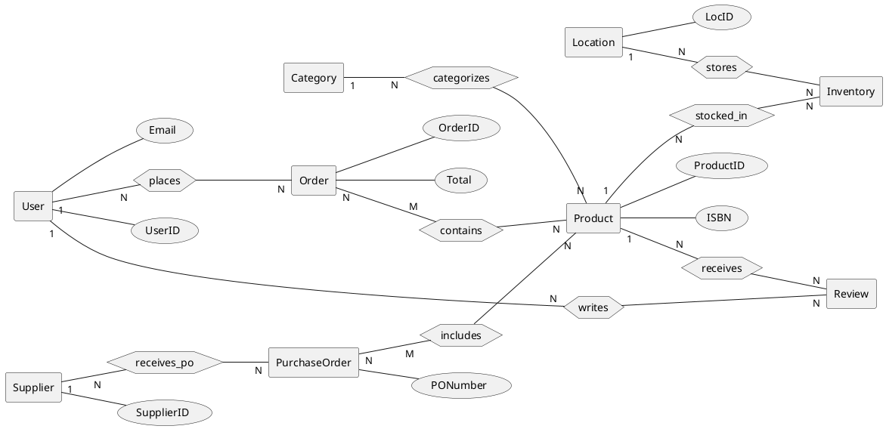
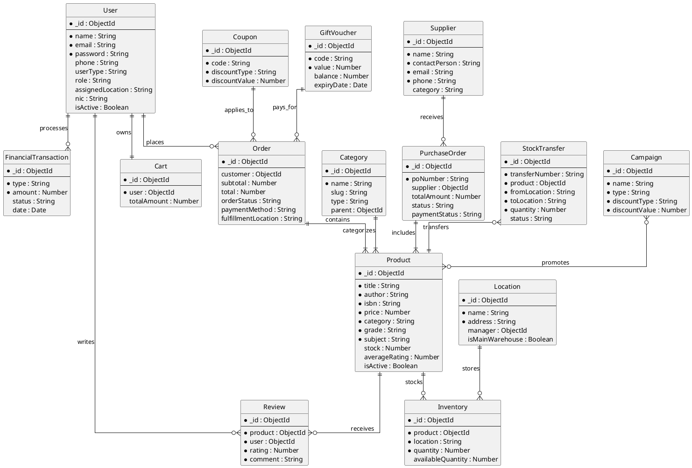

# Database ER Diagrams

Here are the PlantUML diagrams for the Methsara Publications Webstore project database. I've provided two versions: 
1. **Academic Chen ER Diagram** (as requested, highlighting entities, relationships, and key attributes).
2. **Standard ER Diagram (Crow's Foot)** (which is more practical for viewing all fields and data types).

## 1. Chen ER Diagram (Academic Notation)
In academic contexts (like an IT project viva), Chen notation is often requested. PlantUML doesn't have a built-in "Chen" template, but we can recreate it using basic shapes (`rectangle` for entities, `diamond` for relationships, and `usecase` (ellipse) for attributes).

> **Note:** To keep the diagram readable, only primary keys and major attributes are shown. Adding all 100+ attributes would make a Chen diagram completely unreadable.

## 2. Standard ER Diagram (Crow's Foot Notation)
This is the industry-standard way to represent a database schema in PlantUML. It includes all major entities, their fields, and accurate multiplicity relationships (1-to-many, many-to-many, etc.).

