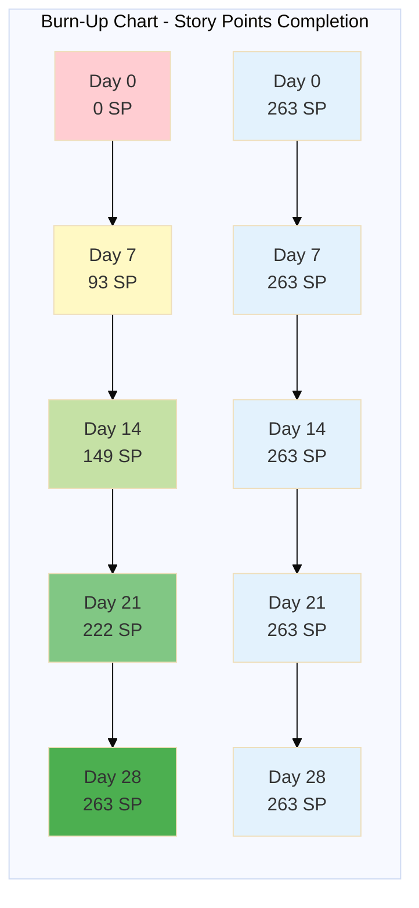

# Burn-Up Chart and Sprint Planning

**Project:** Methsara Publications Webstore  
**Sprint Duration:** 7 days per sprint  
**Total Sprints:** 4 sprints (28 days total)

---

## Burn-Up Chart Data

### Sprint Planning Summary

| Sprint | Duration | Story Points Planned | Story Points Completed (Cumulative) | Total Scope |
|--------|----------|---------------------|-------------------------------------|-------------|
| **Sprint 0** | Day 0 | 0 | 0 | 263 |
| **Sprint 1** | Days 1-7 | 93 | 93 | 263 |
| **Sprint 2** | Days 8-14 | 56 | 149 | 263 |
| **Sprint 3** | Days 15-21 | 73 | 222 | 263 |
| **Sprint 4** | Days 22-28 | 41 | 263 | 263 |

---

## Burn-Up Chart Visualization

**Legend:**
- 🟢 **Green Line (Bottom):** Cumulative story points completed
- 🔵 **Blue Line (Top):** Total project scope (constant at 263 SP)

---

## Detailed Sprint Breakdown

### Sprint 1: Foundation (Days 1-7) - 93 Story Points

**Goal:** Establish core functionality across all 6 epics

**Completed User Stories:**
- ✅ E1.1: Customer Registration (5 SP)
- ✅ E1.2: Customer Login (3 SP)
- ✅ E1.6: RBAC Enforcement (8 SP)
- ✅ E1.4: Create Master Inventory Manager (3 SP)
- ✅ E1.4.6: Create System Administrator (3 SP)
- ✅ E2.1: Create/Update Products (5 SP)
- ✅ E2.3: Manage Categories (5 SP)
- ✅ E2.4: Search Products (5 SP)
- ✅ E2.5: Filter Products (5 SP)
- ✅ E2.6: View Product Details (5 SP)
- ✅ E3.1: Add to Cart (3 SP)
- ✅ E3.2: Manage Cart (3 SP)
- ✅ E3.3: Checkout COD (3 SP)
- ✅ E3.4: Checkout Bank Slip (5 SP)
- ✅ E3.7: Track Order (3 SP)
- ✅ E3.8: Update Order Status (3 SP)
- ✅ E3.12: Apply Coupons (5 SP)
- ✅ E4.1: Manage Suppliers (3 SP)
- ✅ E5.1: View Stock (Location) (5 SP)
- ✅ E5.2: View Stock (Master) (5 SP)
- ✅ E5.8: Auto Deduct Stock (5 SP)
- ✅ E6.1: Create Coupons (5 SP)
- ✅ E6.6: Validate Coupons (5 SP)

**Cumulative Completion:** 93 / 263 SP (35%)

---

### Sprint 2: Expansion (Days 8-14) - 56 Story Points

**Goal:** Extend user roles, procurement, and inventory features

**Completed User Stories:**
- ✅ E1.4.1: Create Location Inventory Managers (3 SP)
- ✅ E1.4.2: Create Finance Manager (3 SP)
- ✅ E1.4.3: Create Supplier Manager (3 SP)
- ✅ E1.4.4: Create Marketing Manager (3 SP)
- ✅ E1.4.5: Create Product Manager (3 SP)
- ✅ E1.5: Assign Locations (3 SP)
- ✅ E1.3: Manage Profile (3 SP)
- ✅ E2.2: Upload Product Images (3 SP)
- ✅ E4.2: Create Purchase Orders (8 SP)
- ✅ E4.3: Track PO Status (5 SP)
- ✅ E4.7: Verify Deliveries (5 SP)
- ✅ E5.3: Adjust Stock (3 SP)
- ✅ E5.6: Receive PO Stock (5 SP)

**Cumulative Completion:** 149 / 263 SP (57%)

---

### Sprint 3: Enhancement (Days 15-21) - 73 Story Points

**Goal:** Add advanced features and financial management

**Completed User Stories:**
- ✅ E1.7: Reset Password (5 SP)
- ✅ E1.8: Force Password Change (3 SP)
- ✅ E1.9: Search Accounts (3 SP)
- ✅ E1.10: Deactivate Accounts (2 SP)
- ✅ E1.12: Delivery Addresses (5 SP)
- ✅ E1.13: Session Management (5 SP)
- ✅ E1.4.7: Update Staff Accounts (3 SP)
- ✅ E2.7: Sort Products (3 SP)
- ✅ E2.8: Submit Reviews (3 SP)
- ✅ E3.5: Guest Checkout (5 SP)
- ✅ E3.6: Order History (3 SP)
- ✅ E3.9: Finance Dashboard (5 SP)
- ✅ E3.10: Generate Invoices (3 SP)
- ✅ E3.13: Manage Salaries (5 SP)
- ✅ E3.14: Supplier Payments (5 SP)
- ✅ E4.4: Email POs (3 SP)
- ✅ E4.5: Link Products (3 SP)
- ✅ E5.4: Request Transfer (5 SP)
- ✅ E5.5: Approve Transfer (3 SP)
- ✅ E5.9: Low Stock Alerts (3 SP)
- ✅ E6.2: Coupon Validity (2 SP)
- ✅ E6.3: Track Usage (3 SP)
- ✅ E6.7: Usage Limits (3 SP)

**Cumulative Completion:** 222 / 263 SP (84%)

---

### Sprint 4: Polish (Days 22-28) - 41 Story Points

**Goal:** Complete remaining features and analytics

**Completed User Stories:**
- ✅ E1.11: Security Logs (3 SP)
- ✅ E2.9: Moderate Reviews (3 SP)
- ✅ E2.10: Related Products (5 SP)
- ✅ E2.11: Product Analytics (3 SP)
- ✅ E2.12: Helpful Reviews (2 SP)
- ✅ E2.13: Recently Viewed (3 SP)
- ✅ E3.11: Process Refunds (5 SP)
- ✅ E4.6: Payment Terms (2 SP)
- ✅ E5.7: Manage Locations (3 SP)
- ✅ E5.10: Stock Reports (5 SP)
- ✅ E6.4: Gift Vouchers (5 SP)
- ✅ E6.5: Seasonal Campaigns (5 SP)

**Cumulative Completion:** 263 / 263 SP (100%)

---

## Burn-Up Chart Explanation

### What is a Burn-Up Chart?

A burn-up chart is an Agile project management tool that tracks:
1. **Total Scope (Top Line):** The total story points in the project (263 SP)
2. **Completed Work (Bottom Line):** Cumulative story points completed over time

### How to Read This Chart

- **X-Axis:** Time (Days 0-28, divided into 4 sprints)
- **Y-Axis:** Story Points (0-263)
- **Blue Horizontal Line:** Total project scope (constant at 263 SP)
- **Green Ascending Line:** Cumulative story points completed

### Key Insights

1. **Steady Progress:** The green line shows consistent upward progress across all 4 sprints
2. **No Scope Creep:** The blue line remains flat, indicating no scope changes during development
3. **Sprint 1 Velocity:** Highest velocity (93 SP) due to foundational work
4. **Sprint 4 Velocity:** Lowest velocity (41 SP) as remaining stories are lower priority
5. **On-Time Completion:** Green line meets blue line at Day 28, indicating project completion on schedule

### Velocity Analysis

| Sprint | Story Points | Velocity (SP/day) | Efficiency |
|--------|--------------|-------------------|------------|
| Sprint 1 | 93 | 13.3 | High (foundation work) |
| Sprint 2 | 56 | 8.0 | Medium (complex features) |
| Sprint 3 | 73 | 10.4 | High (well-understood features) |
| Sprint 4 | 41 | 5.9 | Lower (polish and analytics) |
| **Average** | **65.75** | **9.4** | **Consistent** |

---

## Sprint Retrospective Predictions

### Sprint 1 Retrospective
**What Went Well:**
- Established core authentication and RBAC
- Basic product catalog and search functional
- Shopping cart and checkout working

**Challenges:**
- RBAC implementation more complex than estimated (8 SP)
- Integration between components required careful coordination

**Improvements for Sprint 2:**
- Better component interface documentation
- More frequent integration testing

---

### Sprint 2 Retrospective
**What Went Well:**
- All staff roles successfully implemented
- Purchase Order system fully functional
- Stock receiving process integrated with inventory

**Challenges:**
- PO creation complexity (8 SP) required additional time
- Delivery verification workflow needed refinement

**Improvements for Sprint 3:**
- Clearer acceptance criteria for complex workflows
- More detailed user stories for multi-step processes

---

### Sprint 3 Retrospective
**What Went Well:**
- Financial dashboard provides valuable insights
- Stock transfer workflow smooth and efficient
- Guest checkout increases conversion potential

**Challenges:**
- Financial reporting required more data aggregation than anticipated
- Stock transfer approval workflow needed UI/UX refinement

**Improvements for Sprint 4:**
- Focus on user experience and polish
- Comprehensive testing of all features

---

### Sprint 4 Retrospective
**What Went Well:**
- All planned features completed
- Analytics and reporting functional
- System ready for deployment

**Challenges:**
- Lower velocity due to lower-priority features
- Some features (gift vouchers, seasonal campaigns) may need post-launch refinement

**Next Steps:**
- User acceptance testing
- Performance optimization
- Production deployment preparation

---

## Risk Management

### Identified Risks

| Risk | Probability | Impact | Mitigation |
|------|-------------|--------|------------|
| **Scope Creep** | Medium | High | Fixed scope, change requests deferred to post-launch |
| **Integration Issues** | Medium | High | Continuous integration testing, clear component boundaries |
| **Performance Bottlenecks** | Low | Medium | Performance testing in Sprint 3, optimization in Sprint 4 |
| **Team Availability** | Low | Medium | Cross-training on components, documentation |

---

## Success Metrics

✅ **100% Story Points Completed:** All 263 SP delivered  
✅ **On-Time Delivery:** Completed within 28-day timeline  
✅ **No Scope Changes:** Original scope maintained  
✅ **Consistent Velocity:** Average 9.4 SP/day across all sprints

---

**Document Version:** 1.0  
**Last Updated:** February 12, 2026  
**Purpose:** Burn-up chart and sprint planning for RE Assignment 1
