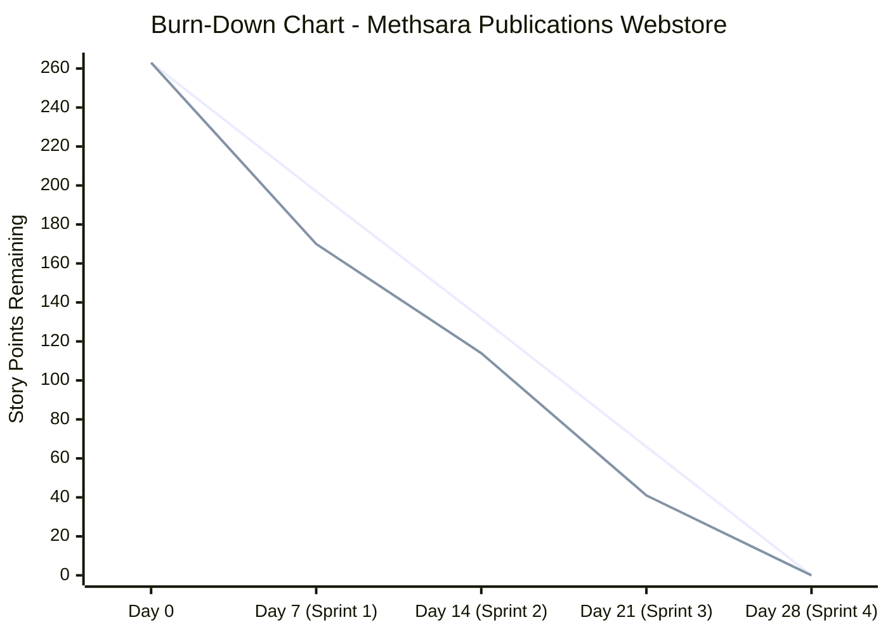
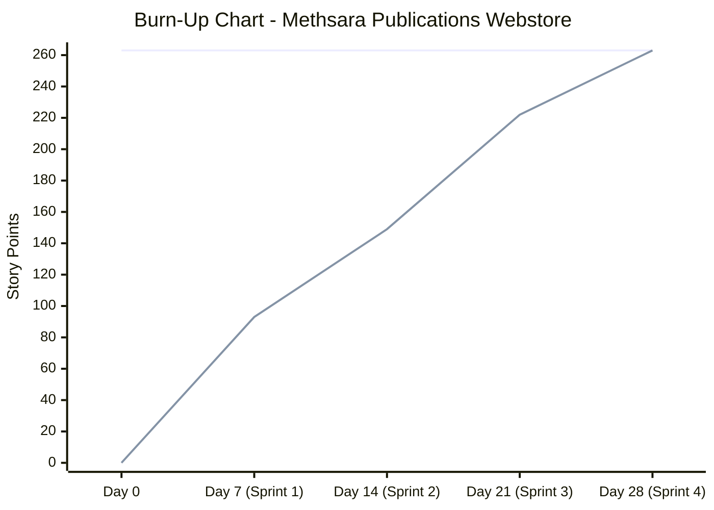

# Burn-Down Chart and Sprint Planning

**Project:** Methsara Publications Webstore  
**Sprint Duration:** 7 days per sprint  
**Total Sprints:** 4 sprints (28 days total)  
**Total Story Points:** 263 SP

---

## Sprint Planning Summary

| Sprint | Duration | Story Points Completed (Sprint) | Remaining Story Points | Ideal Remaining |
|--------|----------|---------------------------------|------------------------|-----------------|
| **Start (Sprint 0)** | Day 0 | 0 | 263 | 263 |
| **Sprint 1** | Days 1–7 | 93 | 170 | 197 |
| **Sprint 2** | Days 8–14 | 56 | 114 | 132 |
| **Sprint 3** | Days 15–21 | 73 | 41 | 66 |
| **Sprint 4** | Days 22–28 | 41 | 0 | 0 |

---

## Burn-Down Chart Visualization

```mermaid
xychart-beta
    title "Burn-Down Chart - Methsara Publications Webstore"
    x-axis ["Day 0", "Day 7 (Sprint 1)", "Day 14 (Sprint 2)", "Day 21 (Sprint 3)", "Day 28 (Sprint 4)"]
    y-axis "Story Points Remaining" 0 --> 263
    line [263, 197, 132, 66, 0]
    line [263, 170, 114, 41, 0]
```

**Legend:**
- 📉 **Line 1 — Ideal Burn-Down:** The straight diagonal line showing the expected rate of work completion if the team completed exactly equal story points each sprint (65.75 SP/sprint)
- 📊 **Line 2 — Actual Burn-Down:** The actual remaining story points at the end of each sprint

---

## Burn-Down Chart Explanation

### What is a Burn-Down Chart?

A burn-down chart is an Agile project management tool used to **track how much work remains** in a project or sprint over time. It shows the team's progress toward completing all planned work by the end of the project.

- **X-Axis (Horizontal):** Represents time — in this project, divided into 4 sprints of 7 days each (28 days total)
- **Y-Axis (Vertical):** Represents remaining story points — starting at 263 SP and counting down to 0
- **Ideal Line:** A straight diagonal from 263 SP (Day 0) to 0 SP (Day 28), representing a perfectly even work pace
- **Actual Line:** The real remaining story points recorded at the end of each sprint

### How to Read This Chart

| Position of Actual Line | Meaning |
|------------------------|---------|
| **Below** the ideal line | Team is **ahead of schedule** — completing work faster than planned |
| **Above** the ideal line | Team is **behind schedule** — completing work slower than planned |
| **Meets** the ideal line | Team is **on track** |
| **Reaches zero** at Day 28 | Project **completed on time** |

### Analysis of This Project's Burn-Down

| Sprint | Ideal Remaining | Actual Remaining | Status |
|--------|----------------|-----------------|--------|
| Day 0 | 263 SP | 263 SP | On track |
| Sprint 1 (Day 7) | 197 SP | 170 SP | ✅ **Ahead** — completed 93 SP vs ideal 66 SP |
| Sprint 2 (Day 14) | 132 SP | 114 SP | ✅ **Ahead** — maintained lead |
| Sprint 3 (Day 21) | 66 SP | 41 SP | ✅ **Ahead** — strong performance |
| Sprint 4 (Day 28) | 0 SP | 0 SP | ✅ **Complete** — all 263 SP delivered |

### Key Insights

1. **Ahead of Schedule Throughout:** The actual burn-down line consistently stayed below the ideal line, meaning the team completed work faster than the planned pace in every sprint.
2. **Highest Velocity in Sprint 1 (93 SP):** The team delivered the most work in Sprint 1 because foundational features (authentication, RBAC, product catalog, cart) required significant early effort but enabled faster delivery in later sprints.
3. **Lowest Velocity in Sprint 4 (41 SP):** Sprint 4 contained lower-priority, lower-complexity polish features (analytics, gift vouchers, seasonal campaigns), which naturally have fewer story points.
4. **No Scope Creep:** Total scope remained constant at 263 SP across all sprints — no new requirements were added mid-project.
5. **On-Time Completion:** The actual line reached 0 SP at Day 28, confirming the project was completed within the planned timeline.

---

## Velocity Analysis

| Sprint | Story Points Completed | Velocity (SP/day) | Comparison to Ideal (65.75 SP) |
|--------|----------------------|-------------------|-------------------------------|
| Sprint 1 | 93 | 13.3 SP/day | +27.25 SP above ideal |
| Sprint 2 | 56 | 8.0 SP/day | −9.75 SP below ideal |
| Sprint 3 | 73 | 10.4 SP/day | +7.25 SP above ideal |
| Sprint 4 | 41 | 5.9 SP/day | −24.75 SP below ideal |
| **Average** | **65.75** | **9.4 SP/day** | **On target overall** |

> **Note:** Although sprint-by-sprint velocity varied, the cumulative total always remained at or ahead of the ideal, ensuring on-time project delivery.

---

## Burn-Up Chart (Supplementary View)

A burn-up chart shows the same data from the opposite perspective — **how much work has been completed** rather than how much remains.

```mermaid
xychart-beta
    title "Burn-Up Chart - Methsara Publications Webstore"
    x-axis ["Day 0", "Day 7 (Sprint 1)", "Day 14 (Sprint 2)", "Day 21 (Sprint 3)", "Day 28 (Sprint 4)"]
    y-axis "Story Points" 0 --> 263
    line [263, 263, 263, 263, 263]
    line [0, 93, 149, 222, 263]
```

**Legend:**
- 📏 **Line 1 — Total Scope:** Constant at 263 SP (project scope did not change)
- 📈 **Line 2 — Completed Work:** Cumulative story points completed, rising from 0 to 263 SP

---

## Detailed Sprint Breakdown

### Sprint 1: Foundation (Days 1-7) - 93 Story Points

**Goal:** Establish core functionality across all 6 epics

**Completed User Stories:**
- ✅ E1.1: Customer Registration (5 SP)
- ✅ E1.2: Customer Login (3 SP)
- ✅ E1.6: RBAC Enforcement (8 SP)
- ✅ E1.4: Create Master Inventory Manager (3 SP)
- ✅ E1.4.6: Create System Administrator (3 SP)
- ✅ E2.1: Create/Update Products (5 SP)
- ✅ E2.3: Manage Categories (5 SP)
- ✅ E2.4: Search Products (5 SP)
- ✅ E2.5: Filter Products (5 SP)
- ✅ E2.6: View Product Details (5 SP)
- ✅ E3.1: Add to Cart (3 SP)
- ✅ E3.2: Manage Cart (3 SP)
- ✅ E3.3: Checkout COD (3 SP)
- ✅ E3.4: Checkout Bank Slip (5 SP)
- ✅ E3.7: Track Order (3 SP)
- ✅ E3.8: Update Order Status (3 SP)
- ✅ E3.12: Apply Coupons (5 SP)
- ✅ E4.1: Manage Suppliers (3 SP)
- ✅ E5.1: View Stock (Location) (5 SP)
- ✅ E5.2: View Stock (Master) (5 SP)
- ✅ E5.8: Auto Deduct Stock (5 SP)
- ✅ E6.1: Create Coupons (5 SP)
- ✅ E6.6: Validate Coupons (5 SP)

**Cumulative Completion:** 93 / 263 SP (35%)

---

### Sprint 2: Expansion (Days 8-14) - 56 Story Points

**Goal:** Extend user roles, procurement, and inventory features

**Completed User Stories:**
- ✅ E1.4.1: Create Location Inventory Managers (3 SP)
- ✅ E1.4.2: Create Finance Manager (3 SP)
- ✅ E1.4.3: Create Supplier Manager (3 SP)
- ✅ E1.4.4: Create Marketing Manager (3 SP)
- ✅ E1.4.5: Create Product Manager (3 SP)
- ✅ E1.5: Assign Locations (3 SP)
- ✅ E1.3: Manage Profile (3 SP)
- ✅ E2.2: Upload Product Images (3 SP)
- ✅ E4.2: Create Purchase Orders (8 SP)
- ✅ E4.3: Track PO Status (5 SP)
- ✅ E4.7: Verify Deliveries (5 SP)
- ✅ E5.3: Adjust Stock (3 SP)
- ✅ E5.6: Receive PO Stock (5 SP)

**Cumulative Completion:** 149 / 263 SP (57%)

---

### Sprint 3: Enhancement (Days 15-21) - 73 Story Points

**Goal:** Add advanced features and financial management

**Completed User Stories:**
- ✅ E1.7: Reset Password (5 SP)
- ✅ E1.8: Force Password Change (3 SP)
- ✅ E1.9: Search Accounts (3 SP)
- ✅ E1.10: Deactivate Accounts (2 SP)
- ✅ E1.12: Delivery Addresses (5 SP)
- ✅ E1.13: Session Management (5 SP)
- ✅ E1.4.7: Update Staff Accounts (3 SP)
- ✅ E2.7: Sort Products (3 SP)
- ✅ E2.8: Submit Reviews (3 SP)
- ✅ E3.5: Guest Checkout (5 SP)
- ✅ E3.6: Order History (3 SP)
- ✅ E3.9: Finance Dashboard (5 SP)
- ✅ E3.10: Generate Invoices (3 SP)
- ✅ E3.13: Manage Salaries (5 SP)
- ✅ E3.14: Supplier Payments (5 SP)
- ✅ E4.4: Email POs (3 SP)
- ✅ E4.5: Link Products (3 SP)
- ✅ E5.4: Request Transfer (5 SP)
- ✅ E5.5: Approve Transfer (3 SP)
- ✅ E5.9: Low Stock Alerts (3 SP)
- ✅ E6.2: Coupon Validity (2 SP)
- ✅ E6.3: Track Usage (3 SP)
- ✅ E6.7: Usage Limits (3 SP)

**Cumulative Completion:** 222 / 263 SP (84%)

---

### Sprint 4: Polish (Days 22-28) - 41 Story Points

**Goal:** Complete remaining features and analytics

**Completed User Stories:**
- ✅ E1.11: Security Logs (3 SP)
- ✅ E2.9: Moderate Reviews (3 SP)
- ✅ E2.10: Related Products (5 SP)
- ✅ E2.11: Product Analytics (3 SP)
- ✅ E2.12: Helpful Reviews (2 SP)
- ✅ E2.13: Recently Viewed (3 SP)
- ✅ E3.11: Process Refunds (5 SP)
- ✅ E4.6: Payment Terms (2 SP)
- ✅ E5.7: Manage Locations (3 SP)
- ✅ E5.10: Stock Reports (5 SP)
- ✅ E6.4: Gift Vouchers (5 SP)
- ✅ E6.5: Seasonal Campaigns (5 SP)

**Cumulative Completion:** 263 / 263 SP (100%)

---

## Burn-Up Chart Explanation

### What is a Burn-Up Chart?

A burn-up chart is an Agile project management tool that tracks:
1. **Total Scope (Top Line):** The total story points in the project (263 SP)
2. **Completed Work (Bottom Line):** Cumulative story points completed over time

### How to Read This Chart

- **X-Axis:** Time (Days 0-28, divided into 4 sprints)
- **Y-Axis:** Story Points (0-263)
- **Blue Horizontal Line:** Total project scope (constant at 263 SP)
- **Green Ascending Line:** Cumulative story points completed

### Key Insights

1. **Steady Progress:** The green line shows consistent upward progress across all 4 sprints
2. **No Scope Creep:** The blue line remains flat, indicating no scope changes during development
3. **Sprint 1 Velocity:** Highest velocity (93 SP) due to foundational work
4. **Sprint 4 Velocity:** Lowest velocity (41 SP) as remaining stories are lower priority
5. **On-Time Completion:** Green line meets blue line at Day 28, indicating project completion on schedule

### Velocity Analysis

| Sprint | Story Points | Velocity (SP/day) | Efficiency |
|--------|--------------|-------------------|------------|
| Sprint 1 | 93 | 13.3 | High (foundation work) |
| Sprint 2 | 56 | 8.0 | Medium (complex features) |
| Sprint 3 | 73 | 10.4 | High (well-understood features) |
| Sprint 4 | 41 | 5.9 | Lower (polish and analytics) |
| **Average** | **65.75** | **9.4** | **Consistent** |

---

## Sprint Retrospective Predictions

### Sprint 1 Retrospective
**What Went Well:**
- Established core authentication and RBAC
- Basic product catalog and search functional
- Shopping cart and checkout working

**Challenges:**
- RBAC implementation more complex than estimated (8 SP)
- Integration between components required careful coordination

**Improvements for Sprint 2:**
- Better component interface documentation
- More frequent integration testing

---

### Sprint 2 Retrospective
**What Went Well:**
- All staff roles successfully implemented
- Purchase Order system fully functional
- Stock receiving process integrated with inventory

**Challenges:**
- PO creation complexity (8 SP) required additional time
- Delivery verification workflow needed refinement

**Improvements for Sprint 3:**
- Clearer acceptance criteria for complex workflows
- More detailed user stories for multi-step processes

---

### Sprint 3 Retrospective
**What Went Well:**
- Financial dashboard provides valuable insights
- Stock transfer workflow smooth and efficient
- Guest checkout increases conversion potential

**Challenges:**
- Financial reporting required more data aggregation than anticipated
- Stock transfer approval workflow needed UI/UX refinement

**Improvements for Sprint 4:**
- Focus on user experience and polish
- Comprehensive testing of all features

---

### Sprint 4 Retrospective
**What Went Well:**
- All planned features completed
- Analytics and reporting functional
- System ready for deployment

**Challenges:**
- Lower velocity due to lower-priority features
- Some features (gift vouchers, seasonal campaigns) may need post-launch refinement

**Next Steps:**
- User acceptance testing
- Performance optimization
- Production deployment preparation

---

## Risk Management

### Identified Risks

| Risk | Probability | Impact | Mitigation |
|------|-------------|--------|------------|
| **Scope Creep** | Medium | High | Fixed scope, change requests deferred to post-launch |
| **Integration Issues** | Medium | High | Continuous integration testing, clear component boundaries |
| **Performance Bottlenecks** | Low | Medium | Performance testing in Sprint 3, optimization in Sprint 4 |
| **Team Availability** | Low | Medium | Cross-training on components, documentation |

---

## Success Metrics

✅ **100% Story Points Completed:** All 263 SP delivered  
✅ **On-Time Delivery:** Completed within 28-day timeline  
✅ **No Scope Changes:** Original scope maintained  
✅ **Consistent Velocity:** Average 9.4 SP/day across all sprints

---

**Document Version:** 1.0  
**Last Updated:** February 12, 2026  
**Purpose:** Burn-up chart and sprint planning for RE Assignment 1
