# Business Model Canvas

**Project:** Methsara Publications Webstore  
**Date:** February 12, 2026

---

## Business Model Canvas Overview

```mermaid
graph TB
    subgraph "Business Model Canvas - Methsara Publications Webstore"
        KP["<b>Key Partners</b><br/>• Suppliers/Printers<br/>• Delivery Partners<br/>• Payment Processors<br/>• Schools & Tuition Centers<br/>• Technology Providers"]
        
        KA["<b>Key Activities</b><br/>• Product Catalog Management<br/>• Multi-location Inventory<br/>• Order Processing<br/>• Marketing Campaigns<br/>• Customer Support"]
        
        KR["<b>Key Resources</b><br/>• E-commerce Platform<br/>• Product Inventory<br/>• Staff (6 roles)<br/>• 3 Branch Locations<br/>• Customer Database"]
        
        VP["<b>Value Propositions</b><br/>• 24/7 Online Access<br/>• Grade-specific Materials<br/>• Multi-location Availability<br/>• Secure Payments<br/>• Fast Delivery"]
        
        CR["<b>Customer Relationships</b><br/>• Self-service Platform<br/>• Email Support<br/>• Order Tracking<br/>• Reviews & Ratings<br/>• Loyalty Programs"]
        
        CH["<b>Channels</b><br/>• Website (Primary)<br/>• Email Marketing<br/>• Social Media<br/>• Physical Stores<br/>• School Partnerships"]
        
        CS["<b>Customer Segments</b><br/>• Students (Grades 6-13)<br/>• Parents<br/>• Teachers<br/>• Schools<br/>• Tuition Centers"]
        
        C$["<b>Cost Structure</b><br/>• Platform Development & Maintenance<br/>• Inventory Procurement<br/>• Staff Salaries<br/>• Delivery Costs<br/>• Marketing Expenses<br/>• Infrastructure (Hosting, Storage)"]
        
        R$["<b>Revenue Streams</b><br/>• Product Sales (Primary)<br/>• Bulk Orders (Schools/Tuition)<br/>• Gift Vouchers<br/>• Premium Delivery Options"]
    end
    
    KP --> KA
    KA --> VP
    KR --> VP
    VP --> CR
    CR --> CS
    VP --> CH
    CH --> CS
    CS --> R$
    KP --> C$
    KA --> C$
    KR --> C$
    
    style KP fill:#e3f2fd
    style KA fill:#f3e5f5
    style KR fill:#fff9c4
    style VP fill:#c8e6c9
    style CR fill:#ffccbc
    style CH fill:#d1c4e9
    style CS fill:#ffecb3
    style C$ fill:#ffcdd2
    style R$ fill:#c5e1a5
```

---

## Detailed Business Model Components

### 1. Key Partners

| Partner Type | Role | Strategic Importance |
|--------------|------|---------------------|
| **Suppliers/Printers** | Provide educational materials and books | Critical for product availability and quality |
| **Delivery Partners** | Handle logistics and last-mile delivery | Essential for customer satisfaction and reach |
| **Payment Processors** | Process bank transfers and COD payments | Enable secure transactions |
| **Schools & Tuition Centers** | Bulk purchasing partners | Drive volume sales and market credibility |
| **Technology Providers** | Cloud hosting, email services, security | Ensure platform reliability and scalability |

**Partnership Strategy:**
- Long-term contracts with reliable suppliers for consistent quality
- Performance-based agreements with delivery partners
- Institutional partnerships with schools for recurring bulk orders

---

### 2. Key Activities

| Activity | Description | Frequency |
|----------|-------------|-----------|
| **Product Catalog Management** | Create, update, and organize products by Grade/Subject/Exam | Daily |
| **Multi-location Inventory Management** | Track stock across Main, Balangoda, and Kottawa branches | Real-time |
| **Order Processing & Fulfillment** | Process orders, manage payments, coordinate delivery | Daily |
| **Marketing Campaigns** | Create promotions, coupons, and seasonal campaigns | Weekly/Monthly |
| **Customer Support** | Handle inquiries, process refunds, manage reviews | Daily |
| **Supplier Procurement** | Create Purchase Orders, verify deliveries, manage relationships | Weekly |
| **Financial Management** | Generate reports, process payments, manage invoices | Daily/Monthly |

---

### 3. Key Resources

#### Physical Resources
- **3 Branch Locations:** Main Branch (HQ), Balangoda Branch, Kottawa Branch
- **Product Inventory:** Educational materials for Grades 6-13
- **Office Infrastructure:** Computers, printers, storage facilities

#### Human Resources
- **Master Inventory Manager:** Oversees all locations
- **Location-Specific Inventory Managers (3):** Manage individual branches
- **Finance Manager:** Handles financial operations
- **Supplier Manager:** Manages procurement
- **Product Manager:** Manages catalog
- **Marketing Manager:** Drives campaigns
- **System Administrator:** Manages platform and users

#### Intellectual Resources
- **E-commerce Platform:** Custom-built webstore
- **Customer Database:** Customer profiles, order history, preferences
- **Product Categorization System:** Grade/Subject/Exam taxonomy

#### Financial Resources
- **Working Capital:** For inventory procurement
- **Technology Budget:** Platform development and maintenance

---

### 4. Value Propositions

#### For Students
- **24/7 Access:** Browse and purchase anytime, anywhere
- **Grade-Specific Search:** Easy filtering by grade level and subject
- **Product Reviews:** Learn from other students' experiences
- **Stock Visibility:** See availability across all locations

#### For Parents
- **Secure Payments:** COD and bank transfer options
- **Order Tracking:** Monitor delivery status in real-time
- **Quality Assurance:** Verified educational materials
- **Convenience:** No need to visit physical stores

#### For Teachers
- **Bulk Ordering:** Easy institutional purchases
- **Product Recommendations:** Suggest materials to students
- **Comprehensive Catalog:** All subjects and grades in one place

#### For Business (Methsara Publications)
- **Market Expansion:** Reach beyond physical store locations
- **Operational Efficiency:** Automated inventory and order management
- **Data Insights:** Customer behavior and sales analytics
- **Competitive Advantage:** Modern digital presence

---

### 5. Customer Relationships

| Relationship Type | Implementation | Goal |
|-------------------|----------------|------|
| **Self-Service** | User-friendly website with search, filters, and checkout | Empower customers to shop independently |
| **Automated Service** | Email notifications for orders, shipping, and promotions | Keep customers informed |
| **Personal Assistance** | Email support for inquiries and issues | Build trust and resolve problems |
| **Communities** | Product reviews and ratings | Foster customer engagement |
| **Loyalty Programs** | Discount coupons and promotional campaigns | Encourage repeat purchases |

**Retention Strategy:**
- Email marketing for new products and promotions
- Seasonal campaigns during exam periods
- Loyalty rewards for frequent customers
- Personalized product recommendations

---

### 6. Channels

#### Awareness
- **Social Media:** Facebook, Instagram for brand awareness
- **School Partnerships:** Direct outreach to institutions
- **Word of Mouth:** Customer reviews and recommendations

#### Evaluation
- **Website:** Detailed product information, reviews, and comparisons
- **Physical Stores:** Customers can still visit branches

#### Purchase
- **E-commerce Platform:** Primary sales channel (24/7)
- **Physical Stores:** Secondary channel for walk-in customers

#### Delivery
- **Delivery Partners:** Home delivery for online orders
- **Store Pickup:** Option to collect from nearest branch

#### After-Sales
- **Email Support:** Customer service and issue resolution
- **Order Tracking:** Real-time status updates
- **Review System:** Feedback collection

---

### 7. Customer Segments

| Segment | Size | Needs | Behavior |
|---------|------|-------|----------|
| **Students (Grades 6-13)** | Large | Exam preparation materials, affordable pricing | Price-sensitive, seasonal demand (exam periods) |
| **Parents** | Large | Quality materials, secure payments, fast delivery | Value-conscious, bulk purchases for multiple children |
| **Teachers** | Medium | Comprehensive resources, bulk ordering | Recommend to students, institutional buyers |
| **Schools** | Small | Bulk purchases for libraries | High-value orders, recurring purchases |
| **Tuition Centers** | Small | Wholesale materials for students | Volume buyers, regular orders |

**Segmentation Strategy:**
- **Primary Focus:** Individual students and parents (high volume)
- **Secondary Focus:** Teachers and tuition centers (influencers and bulk buyers)
- **Tertiary Focus:** Schools (high-value institutional sales)

---

### 8. Cost Structure

#### Fixed Costs
- **Platform Development & Maintenance:** Rs. 500,000 (initial), Rs. 50,000/month (maintenance)
- **Staff Salaries:** Rs. 800,000/month (7 staff members)
- **Infrastructure (Hosting, Storage):** Rs. 30,000/month
- **Branch Rent & Utilities:** Rs. 200,000/month (3 locations)

#### Variable Costs
- **Inventory Procurement:** 60% of product selling price
- **Delivery Costs:** Rs. 300-500 per order
- **Marketing Expenses:** 5-10% of monthly revenue
- **Payment Processing Fees:** 2-3% of transaction value

**Cost Optimization Strategies:**
- Bulk procurement discounts from suppliers
- Efficient multi-location inventory to reduce transfer costs
- Automated processes to minimize manual labor
- Performance-based delivery partner contracts

---

### 9. Revenue Streams

| Revenue Source | Pricing Model | Contribution |
|----------------|---------------|--------------|
| **Product Sales (Individual)** | Retail pricing (Rs. 200-2,000 per item) | 70% of revenue |
| **Bulk Orders (Schools/Tuition)** | Volume discounts (10-20% off retail) | 20% of revenue |
| **Gift Vouchers** | Fixed denominations (Rs. 500, 1,000, 2,000) | 5% of revenue |
| **Premium Delivery** | Express delivery (Rs. 500 extra) | 5% of revenue |

**Revenue Projections:**
- **Month 1-3:** Rs. 1,000,000/month (initial adoption)
- **Month 4-6:** Rs. 2,500,000/month (growth phase)
- **Month 7-12:** Rs. 4,000,000/month (steady state)
- **Peak Seasons (Exam periods):** 150-200% of average monthly revenue

**Pricing Strategy:**
- Competitive pricing aligned with market rates
- Promotional discounts during off-peak periods
- Volume discounts for institutional buyers
- Free delivery for orders above Rs. 2,000

---

## Business Model Validation

### Strengths
✅ **Market Need:** Clear demand for online educational materials  
✅ **Competitive Advantage:** Multi-location inventory and 24/7 access  
✅ **Scalability:** Digital platform can expand to new locations easily  
✅ **Customer Convenience:** Multiple payment options and delivery methods

### Challenges
⚠️ **Competition:** Established online bookstores and educational platforms  
⚠️ **Logistics:** Delivery reliability in remote areas  
⚠️ **Customer Adoption:** Transitioning traditional customers to online platform  
⚠️ **Technology Dependence:** Platform downtime affects sales

### Opportunities
🎯 **Market Expansion:** Reach students nationwide, not just local areas  
🎯 **Data Analytics:** Use customer data for personalized recommendations  
🎯 **Partnerships:** Collaborate with more schools and tuition centers  
🎯 **Product Diversification:** Add digital resources (e-books, online courses)

### Threats
⚡ **Economic Factors:** Reduced education spending during economic downturns  
⚡ **Digital Piracy:** Unauthorized copies of educational materials  
⚡ **Technology Changes:** Need to continuously update platform  
⚡ **Supplier Reliability:** Dependence on timely supplier deliveries

---

**Document Version:** 1.0  
**Last Updated:** February 12, 2026  
**Purpose:** Business model analysis for RE Assignment 1
