# Strategic Dependency (SD) Diagram

**Project:** Methsara Publications Webstore  
**Purpose:** Model strategic dependencies between key stakeholders and actors

---

## Strategic Dependency Model

This diagram captures the organizational context and shows how different actors depend on each other to achieve their goals.

```mermaid
graph TB
    %% Actors
    Customer["Customer<br/>(Student/Parent/Teacher)"]
    BusinessOwner["Business Owner<br/>(Methsara Publications)"]
    MasterInvMgr["Master Inventory<br/>Manager"]
    LocInvMgr["Location-Specific<br/>Inventory Manager"]
    ProductMgr["Product Manager"]
    MarketingMgr["Marketing Manager"]
    FinanceMgr["Finance Manager"]
    SupplierMgr["Supplier Manager"]
    SysAdmin["System<br/>Administrator"]
    Supplier["Supplier"]
    DeliveryPartner["Delivery Partner"]
    
    %% Customer Dependencies
    Customer -->|"Depends on"| ProductMgr
    Customer -.->|"Quality Products"| ProductMgr
    
    Customer -->|"Depends on"| LocInvMgr
    Customer -.->|"Product Availability"| LocInvMgr
    
    Customer -->|"Depends on"| MarketingMgr
    Customer -.->|"Discounts & Promotions"| MarketingMgr
    
    Customer -->|"Depends on"| DeliveryPartner
    Customer -.->|"Timely Delivery"| DeliveryPartner
    
    %% Business Owner Dependencies
    BusinessOwner -->|"Depends on"| Customer
    BusinessOwner -.->|"Revenue & Growth"| Customer
    
    BusinessOwner -->|"Depends on"| MasterInvMgr
    BusinessOwner -.->|"Efficient Operations"| MasterInvMgr
    
    BusinessOwner -->|"Depends on"| FinanceMgr
    BusinessOwner -.->|"Financial Insights"| FinanceMgr
    
    BusinessOwner -->|"Depends on"| MarketingMgr
    BusinessOwner -.->|"Market Expansion"| MarketingMgr
    
    %% Master Inventory Manager Dependencies
    MasterInvMgr -->|"Depends on"| LocInvMgr
    MasterInvMgr -.->|"Accurate Stock Data"| LocInvMgr
    
    MasterInvMgr -->|"Depends on"| SupplierMgr
    MasterInvMgr -.->|"Timely Procurement"| SupplierMgr
    
    %% Location Inventory Manager Dependencies
    LocInvMgr -->|"Depends on"| SupplierMgr
    LocInvMgr -.->|"Stock Replenishment"| SupplierMgr
    
    LocInvMgr -->|"Depends on"| ProductMgr
    LocInvMgr -.->|"Product Information"| ProductMgr
    
    %% Product Manager Dependencies
    ProductMgr -->|"Depends on"| Customer
    ProductMgr -.->|"Feedback & Reviews"| Customer
    
    ProductMgr -->|"Depends on"| SupplierMgr
    ProductMgr -.->|"Product Sourcing Info"| SupplierMgr
    
    %% Marketing Manager Dependencies
    MarketingMgr -->|"Depends on"| FinanceMgr
    MarketingMgr -.->|"Campaign Budget"| FinanceMgr
    
    MarketingMgr -->|"Depends on"| Customer
    MarketingMgr -.->|"Engagement Data"| Customer
    
    %% Finance Manager Dependencies
    FinanceMgr -->|"Depends on"| Customer
    FinanceMgr -.->|"Payment Collection"| Customer
    
    FinanceMgr -->|"Depends on"| Supplier
    FinanceMgr -.->|"Invoice Accuracy"| Supplier
    
    %% Supplier Manager Dependencies
    SupplierMgr -->|"Depends on"| Supplier
    SupplierMgr -.->|"Reliable Supply"| Supplier
    
    SupplierMgr -->|"Depends on"| FinanceMgr
    SupplierMgr -.->|"Payment Processing"| FinanceMgr
    
    %% System Administrator Dependencies
    SysAdmin -->|"Manages"| MasterInvMgr
    SysAdmin -->|"Manages"| LocInvMgr
    SysAdmin -->|"Manages"| ProductMgr
    SysAdmin -->|"Manages"| MarketingMgr
    SysAdmin -->|"Manages"| FinanceMgr
    SysAdmin -->|"Manages"| SupplierMgr
    
    %% Supplier Dependencies
    Supplier -->|"Depends on"| SupplierMgr
    Supplier -.->|"Clear Purchase Orders"| SupplierMgr
    
    Supplier -->|"Depends on"| FinanceMgr
    Supplier -.->|"Timely Payments"| FinanceMgr
    
    %% Delivery Partner Dependencies
    DeliveryPartner -->|"Depends on"| LocInvMgr
    DeliveryPartner -.->|"Accurate Order Info"| LocInvMgr
    
    DeliveryPartner -->|"Depends on"| Customer
    DeliveryPartner -.->|"Delivery Address"| Customer
    
    style Customer fill:#e1f5ff
    style BusinessOwner fill:#fff4e1
    style MasterInvMgr fill:#e8f5e9
    style LocInvMgr fill:#e8f5e9
    style ProductMgr fill:#f3e5f5
    style MarketingMgr fill:#fce4ec
    style FinanceMgr fill:#fff9c4
    style SupplierMgr fill:#e0f2f1
    style SysAdmin fill:#ffebee
    style Supplier fill:#f1f8e9
    style DeliveryPartner fill:#e3f2fd
```

---

## Dependency Legend

- **Solid Arrow (→):** "Depends on" relationship
- **Dotted Arrow (-.->):** The specific dependency/resource needed

---

## Key Strategic Dependencies Explained

### 1. Customer Dependencies
- **On Product Manager:** Customers depend on Product Managers to maintain an accurate, high-quality catalog
- **On Location Inventory Manager:** Customers need products to be in stock at their preferred location
- **On Marketing Manager:** Customers benefit from promotional discounts and campaigns
- **On Delivery Partner:** Customers rely on timely and accurate delivery

### 2. Business Owner Dependencies
- **On Customer:** Revenue and business growth depend on customer purchases
- **On Master Inventory Manager:** Efficient multi-location operations are critical for profitability
- **On Finance Manager:** Financial insights drive strategic business decisions
- **On Marketing Manager:** Market expansion and customer acquisition depend on effective marketing

### 3. Master Inventory Manager Dependencies
- **On Location-Specific Managers:** Accurate stock data from all locations is essential for holistic inventory management
- **On Supplier Manager:** Timely procurement ensures stock availability across all locations

### 4. Location Inventory Manager Dependencies
- **On Supplier Manager:** Stock replenishment through Purchase Orders is critical to maintain inventory
- **On Product Manager:** Accurate product information is needed for inventory tracking

### 5. Product Manager Dependencies
- **On Customer:** Customer feedback and reviews help improve product offerings
- **On Supplier Manager:** Product sourcing information is needed for catalog management

### 6. Marketing Manager Dependencies
- **On Finance Manager:** Campaign budgets must be approved and tracked
- **On Customer:** Customer engagement data informs marketing strategies

### 7. Finance Manager Dependencies
- **On Customer:** Payment collection is essential for cash flow
- **On Supplier:** Accurate invoices are needed for payment processing

### 8. Supplier Manager Dependencies
- **On Supplier:** Reliable supply and timely deliveries are critical
- **On Finance Manager:** Payment processing maintains good supplier relationships

### 9. System Administrator Dependencies
- **Manages All Staff:** System Admin creates and manages all staff accounts and permissions

### 10. Supplier Dependencies
- **On Supplier Manager:** Clear Purchase Orders ensure correct deliveries
- **On Finance Manager:** Timely payments maintain business relationships

### 11. Delivery Partner Dependencies
- **On Location Inventory Manager:** Accurate order information ensures correct deliveries
- **On Customer:** Correct delivery addresses are essential

---

## Organizational Context

The Strategic Dependency model reveals several key organizational insights:

1. **Customer-Centric Design:** Multiple actors (Product Manager, Inventory Manager, Marketing Manager) directly support customer needs

2. **Inventory as Core:** The Master Inventory Manager plays a central coordinating role, connecting suppliers, locations, and customers

3. **Financial Oversight:** Finance Manager has dependencies across the organization (customers, suppliers, marketing)

4. **Supplier Integration:** Supplier Manager acts as a bridge between external suppliers and internal inventory/finance operations

5. **Centralized Administration:** System Administrator manages all staff accounts, ensuring proper access control

---

## Critical Success Factors

Based on the dependency analysis, the following are critical for system success:

1. **Real-time Inventory Visibility:** Location managers must provide accurate stock data to Master Inventory Manager
2. **Efficient Procurement:** Supplier Manager must coordinate effectively with suppliers and Finance Manager
3. **Customer Satisfaction:** Product availability, quality, and timely delivery are interdependent
4. **Financial Transparency:** Finance Manager must provide insights to Business Owner and process payments to suppliers
5. **Effective Marketing:** Marketing campaigns must be coordinated with inventory availability and financial budgets

---

**Document Version:** 1.0  
**Last Updated:** February 12, 2026  
**Purpose:** Strategic dependency modeling for RE Assignment 1
