# UML Use Case Diagram

**Project:** Methsara Publications Webstore  
**Purpose:** Model high-level system behavior and actor interactions

---

## High-Level Use Case Diagram

```mermaid
graph TB
    %% Actors
    Customer((Customer))
    Guest((Guest))
    SysAdmin((System<br/>Administrator))
    ProductMgr((Product<br/>Manager))
    MarketingMgr((Marketing<br/>Manager))
    FinanceMgr((Finance<br/>Manager))
    SupplierMgr((Supplier<br/>Manager))
    MasterInvMgr((Master<br/>Inventory Mgr))
    LocInvMgr((Location<br/>Inventory Mgr))
    
    %% System Boundary
    subgraph System["Methsara Publications Webstore System"]
        %% Customer Use Cases
        UC1[Register Account]
        UC2[Login]
        UC3[Browse Products]
        UC4[Search Products]
        UC5[Add to Cart]
        UC6[Checkout]
        UC7[Track Order]
        UC8[Submit Review]
        UC9[Manage Profile]
        
        %% Guest Use Cases
        UC10[Guest Checkout]
        
        %% Admin Use Cases
        UC11[Manage Staff Accounts]
        UC12[Assign Locations]
        UC13[View Security Logs]
        UC14[Update Order Status]
        
        %% Product Manager Use Cases
        UC15[Manage Products]
        UC16[Manage Categories]
        UC17[Moderate Reviews]
        UC18[View Analytics]
        
        %% Marketing Manager Use Cases
        UC19[Create Coupons]
        UC20[Create Campaigns]
        UC21[Track Coupon Usage]
        
        %% Finance Manager Use Cases
        UC22[View Financial Dashboard]
        UC23[Generate Invoices]
        UC24[Process Payments]
        UC25[Process Refunds]
        
        %% Supplier Manager Use Cases
        UC26[Manage Suppliers]
        UC27[Create Purchase Orders]
        UC28[Track PO Status]
        UC29[Verify Deliveries]
        
        %% Master Inventory Manager Use Cases
        UC30[View All Stock]
        
        %% Location Inventory Manager Use Cases
        UC31[View Location Stock]
        UC32[Adjust Stock]
        UC33[Request Transfer]
        UC34[Approve Transfer]
        UC35[Receive PO Stock]
        
        %% System Use Cases
        UC36[Validate Coupon]
        UC37[Deduct Stock]
        UC38[Send Notifications]
    end
    
    %% Customer Relationships
    Customer --> UC1
    Customer --> UC2
    Customer --> UC3
    Customer --> UC4
    Customer --> UC5
    Customer --> UC6
    Customer --> UC7
    Customer --> UC8
    Customer --> UC9
    
    %% Guest Relationships
    Guest --> UC3
    Guest --> UC4
    Guest --> UC10
    
    %% System Admin Relationships
    SysAdmin --> UC11
    SysAdmin --> UC12
    SysAdmin --> UC13
    SysAdmin --> UC14
    
    %% Product Manager Relationships
    ProductMgr --> UC15
    ProductMgr --> UC16
    ProductMgr --> UC17
    ProductMgr --> UC18
    
    %% Marketing Manager Relationships
    MarketingMgr --> UC19
    MarketingMgr --> UC20
    MarketingMgr --> UC21
    
    %% Finance Manager Relationships
    FinanceMgr --> UC22
    FinanceMgr --> UC23
    FinanceMgr --> UC24
    FinanceMgr --> UC25
    
    %% Supplier Manager Relationships
    SupplierMgr --> UC26
    SupplierMgr --> UC27
    SupplierMgr --> UC28
    SupplierMgr --> UC29
    
    %% Master Inventory Manager Relationships
    MasterInvMgr --> UC30
    
    %% Location Inventory Manager Relationships
    LocInvMgr --> UC31
    LocInvMgr --> UC32
    LocInvMgr --> UC33
    LocInvMgr --> UC34
    LocInvMgr --> UC35
    
    %% Include Relationships
    UC6 -.->|includes| UC36
    UC6 -.->|includes| UC37
    UC1 -.->|includes| UC38
    UC7 -.->|includes| UC38
    
    %% Extend Relationships
    UC10 -.->|extends| UC6
    
    style Customer fill:#e1f5ff
    style Guest fill:#f3e5f5
    style SysAdmin fill:#ffebee
    style ProductMgr fill:#f3e5f5
    style MarketingMgr fill:#fce4ec
    style FinanceMgr fill:#fff9c4
    style SupplierMgr fill:#e0f2f1
    style MasterInvMgr fill:#e8f5e9
    style LocInvMgr fill:#e8f5e9
```

---

## Use Case Descriptions

### Customer Use Cases

| Use Case ID | Use Case Name | Description | Priority |
|-------------|---------------|-------------|----------|
| UC1 | Register Account | Customer creates a new account with email verification | High |
| UC2 | Login | Customer authenticates to access personalized features | High |
| UC3 | Browse Products | Customer views product catalog organized by categories | High |
| UC4 | Search Products | Customer searches for products by name, SKU, or filters | High |
| UC5 | Add to Cart | Customer adds products to shopping cart | High |
| UC6 | Checkout | Customer completes purchase with payment method selection | High |
| UC7 | Track Order | Customer monitors order status and delivery progress | High |
| UC8 | Submit Review | Customer provides feedback and ratings for purchased products | Medium |
| UC9 | Manage Profile | Customer updates personal information and delivery addresses | Medium |

### Guest Use Cases

| Use Case ID | Use Case Name | Description | Priority |
|-------------|---------------|-------------|----------|
| UC10 | Guest Checkout | Guest completes purchase without creating an account | Medium |

### System Administrator Use Cases

| Use Case ID | Use Case Name | Description | Priority |
|-------------|---------------|-------------|----------|
| UC11 | Manage Staff Accounts | Admin creates, updates, and deactivates staff accounts with roles | High |
| UC12 | Assign Locations | Admin assigns inventory managers to specific branch locations | High |
| UC13 | View Security Logs | Admin monitors login history and security events | Low |
| UC14 | Update Order Status | Admin changes order status (Shipped, Delivered, Cancelled) | High |

### Product Manager Use Cases

| Use Case ID | Use Case Name | Description | Priority |
|-------------|---------------|-------------|----------|
| UC15 | Manage Products | Product Manager creates, updates, and archives products | High |
| UC16 | Manage Categories | Product Manager organizes products by Grade, Subject, Exam | High |
| UC17 | Moderate Reviews | Product Manager removes inappropriate customer reviews | Low |
| UC18 | View Analytics | Product Manager analyzes product performance and sales trends | Low |

### Marketing Manager Use Cases

| Use Case ID | Use Case Name | Description | Priority |
|-------------|---------------|-------------|----------|
| UC19 | Create Coupons | Marketing Manager creates discount coupons with rules | High |
| UC20 | Create Campaigns | Marketing Manager sets up seasonal promotional campaigns | Low |
| UC21 | Track Coupon Usage | Marketing Manager monitors coupon redemption and effectiveness | Medium |

### Finance Manager Use Cases

| Use Case ID | Use Case Name | Description | Priority |
|-------------|---------------|-------------|----------|
| UC22 | View Financial Dashboard | Finance Manager views real-time revenue and transaction data | Medium |
| UC23 | Generate Invoices | Finance Manager creates invoices for completed orders | Medium |
| UC24 | Process Payments | Finance Manager handles staff salaries and supplier payments | Medium |
| UC25 | Process Refunds | Finance Manager issues refunds for cancelled/returned orders | Low |

### Supplier Manager Use Cases

| Use Case ID | Use Case Name | Description | Priority |
|-------------|---------------|-------------|----------|
| UC26 | Manage Suppliers | Supplier Manager creates and updates supplier profiles | High |
| UC27 | Create Purchase Orders | Supplier Manager generates POs for inventory restocking | High |
| UC28 | Track PO Status | Supplier Manager monitors PO lifecycle (Sent, In Transit, Received) | High |
| UC29 | Verify Deliveries | Supplier Manager confirms received stock against PO | High |

### Master Inventory Manager Use Cases

| Use Case ID | Use Case Name | Description | Priority |
|-------------|---------------|-------------|----------|
| UC30 | View All Stock | Master Inventory Manager views stock across all locations | High |

### Location Inventory Manager Use Cases

| Use Case ID | Use Case Name | Description | Priority |
|-------------|---------------|-------------|----------|
| UC31 | View Location Stock | Location Manager views stock for assigned branch | High |
| UC32 | Adjust Stock | Location Manager manually adjusts stock (damage, loss, found) | High |
| UC33 | Request Transfer | Location Manager requests stock transfer from another branch | Medium |
| UC34 | Approve Transfer | Location Manager approves incoming transfer requests | Medium |
| UC35 | Receive PO Stock | Location Manager receives stock from Purchase Orders | High |

### System Use Cases (Automated)

| Use Case ID | Use Case Name | Description | Priority |
|-------------|---------------|-------------|----------|
| UC36 | Validate Coupon | System validates coupon codes at checkout | High |
| UC37 | Deduct Stock | System automatically deducts stock when order is placed | High |
| UC38 | Send Notifications | System sends email notifications for various events | High |

---

## Use Case Relationships

### Include Relationships
- **UC6 (Checkout) includes UC36 (Validate Coupon):** Checkout process must validate any applied coupons
- **UC6 (Checkout) includes UC37 (Deduct Stock):** Checkout process must deduct stock from inventory
- **UC1 (Register Account) includes UC38 (Send Notifications):** Registration sends verification email
- **UC7 (Track Order) includes UC38 (Send Notifications):** Order tracking sends status update emails

### Extend Relationships
- **UC10 (Guest Checkout) extends UC6 (Checkout):** Guest checkout is a special case of the checkout process without account requirement

---

## Actor Descriptions

| Actor | Type | Description |
|-------|------|-------------|
| **Customer** | Primary | Students, parents, teachers who purchase educational materials |
| **Guest** | Primary | Visitors who can browse and purchase without creating an account |
| **System Administrator** | Secondary | Manages user accounts, roles, and system settings |
| **Product Manager** | Secondary | Manages product catalog, categories, and reviews |
| **Marketing Manager** | Secondary | Creates and manages promotional campaigns and coupons |
| **Finance Manager** | Secondary | Handles financial reporting, invoices, and payments |
| **Supplier Manager** | Secondary | Manages supplier relationships and procurement |
| **Master Inventory Manager** | Secondary | Oversees inventory across all branch locations |
| **Location Inventory Manager** | Secondary | Manages inventory for a specific branch (Main, Balangoda, Kottawa) |

---

## System Boundary

The **Methsara Publications Webstore System** includes all functionality for:
- Customer-facing e-commerce operations
- Staff management and administration
- Inventory management across multiple locations
- Financial operations and reporting
- Supplier and procurement management
- Marketing and promotional activities

**External Systems (Not Included):**
- Email service provider (used for notifications)
- Payment gateway (for future credit card integration)
- Delivery partner systems (for logistics tracking)

---

**Document Version:** 1.0  
**Last Updated:** February 12, 2026  
**Purpose:** UML use case modeling for RE Assignment 1
